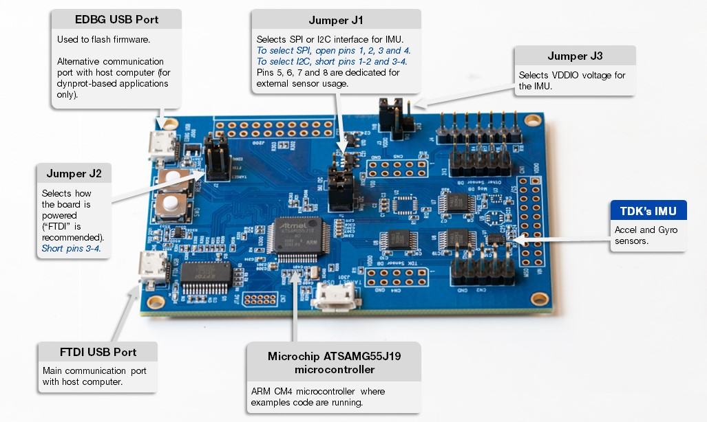
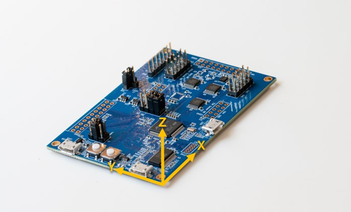

# eMD software for dk45686

## Summary

The eMD (embedded Motion Driver) software for dk45686 consists in a set of examples and tools allowing users to evaluate our IMU's capabilities. 

## Supported Hardware

This software requires Invensense's Developement Kit board.

Optionally, an AK09915 magnetometer can be connected for 9-axis Sensor Fusion application. If needed, please contact your TDK Invensense representative.

## Content

The `algo/` folder contains a library to compute 6 or 9-axis sensor fusion. The library is provided for CM4-FPU with Microchip toolchain built
with the following flags:
* _Compiler flags_: `-mcpu=cortex-m4 -mthumb -mfloat-abi=hard -mfpu=fpv4-sp-d16 -fdata-sections -ffunction-sections`
* _Linker flags_: `-Wl,--gc-sections`

Please contact your TDK Invensense representative if you need the library built with a specific toolchain.

The `sources/board_hal/` folder contains the board drivers, including Microchip's drivers and an hardware abstraction layer (HAL).

The `sources/drivers/` folder contains the drivers for the IMU and the magnetometer.

The `sources/examples/` folder contains a set of examples showcasing the IMU capabilities. 

The `sources/Invn/` folder contains generic utils used in the firmware.

## Build system

The build system relies on Microchip Studio development suite. Please download it from Microchip website: https://www.microchip.com/en-us/tools-resources/develop/microchip-studio.

All examples can be found under `sources/examples/*` and comes with a ready-to-use Microchip studio project (`<example_name>.cproj`).

To build an example, open "Build" menu and click on "Build Solution".

To flash an example on the Developement Kit, open "Debug" menu and click on "Start Debugging and Break". Once the firmware is successfully flashed, open "Debug" menu and click on "Continue" to begin the execution.

## Usage

### Getting firmware traces

On most examples, traces are sent by the firmware through the FTDI USB port. 
For dynprot-based applications, the FTDI USB port is used to exchange binary data with the host. In this case, traces will be sent through the EDBG USB Port. 

To get traces, open a terminal emulator (for instance: https://www.putty.org/) configured as followed:
* Speed: 921600 bauds
* Data bits: 8
* Stop bits: 1
* Parity: None
* Flow control: None

To find out which COM port correspond to which USB port, open *Device Manager* application and expand "Ports (COM & LPT)". The FTDI USB port will appear as "USB Serial Port (COMXX)" and the EDBG USB port will appear as "EDBG Virtual COM Port (COMYY)".

### Changing interfaces

For each example, default interface is set to SPI. To change it, please update `#define SERIF_TYPE` (available at the begining of each example file) to:
* `UI_SPI4` for SPI communication
* `UI_I2C` for I2C communication

### Reference Frame

Unless noted otherwise, examples will report data within the sensor's reference frame as depicted in the datasheet.

