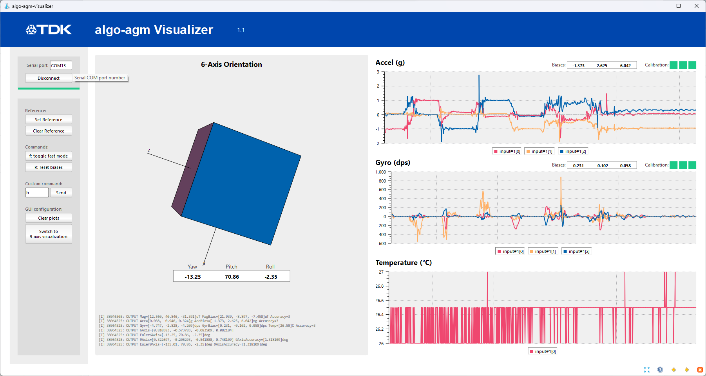

 # algo_agm and algo_agm_dynprot

This application showcases how to use AGM Sensor Fusion library with our IMU and, optionally, AK09915 magnetometer.

Two projects are provided, both based on the same source code (algo_agm.c):
* **algo_agm**: Processes sensors data through the AGM library and prints outputs to a terminal as ASCII char. Commands can be sent through the terminal.
* **algo_agm_dynprot**: Processes sensors data through the AGM library and sends output via a binary protocol to the host (Windows or Linux). A dedicated tool (sensorcli) is required.

Fixed sensor configuration:
* Accel and Gyro set to 400 Hz ODR in Low Noise mode.
* Sensor data are read from the FIFO in highres mode. 
* INT1 is asserted for each frame pushed in FIFO.
* If AK09915 DB is connected, Mag data are retrieved through sensor registers at 100 Hz. Acquisition is synchronized with IMU interrupt.

## Commonalities

### Calibration procedures

For optimal performances, please proceed to sensors calibration:
* To calibrate the gyroscope, keep the board still for ~1 second.
* To calibrate the accelerometer, keep the board still on at least 4 different faces for ~1 second.
* To calibrate the magnetometer, do 8-shape movement (the board should rotate around all 3 axis).

A calibration accuracy flag, ranging from 0 (not calibrated) to 3 (maximum accuracy), is provided for each sensors (accelerometer, gyroscope and magnetometer). 

### Saving and loading calibration in flash

In order to speed up calibration, it is recommended to save sensors offsets in flash and restore them at startup. The application provided showcases how to do that by looking in a dedicated flash area for existing offsets. If offsets are found, algorithm will be initialized with the corresponding value, otherwise, it will consider offsets are 0. Once the application is running, as soon as all sensors (accel, gyro and optionally mag) are calibrated (e.g. calibration flag is 3), the offsets will be written in the dedicated flash area for the next execution. Writing in flash is time consuming and therefore, we will only write the offsets once per hour.

### Connecting AK09915 Daughter-Board

If you need an AK09915 DB, please contact your TDK-InvenSense representative. It shall be connected on the "Other Sensor DB" connectors (CN2 and CN3). 

If the IMU is connected in SPI, please:
* On DK board, J1 connector: open pins 1-2 and 3-4 and short pins 5-6 and 7-8. 
* On AK09915 DB board, J1 connector: short pins 1-2 and 3-4 and open pins 5-6 and 7-8.

If the IMU is connected in I2C, please:
* On DK board, J1 connector: short pins 1-2 and 3-4 and open pins 5-6 and 7-8. 
* On AK09915 DB board, J1 connector: open pins 1-2 and 3-4 and short pins 5-6 and 7-8.

### Mounting Matrix

If AK09915 is being used, a mounting matrix will be applied to the mag data to convert it to the same reference frame as the IMU. If you are not using the standard setup, please consider updating `mag_matrix[9]` array in _algo_agm.c_.

## Specificities of algo_agm

### Command interface

A command interface is provided. You can send the following characters to UART:
* `i`: to show (or hide) algo's input data (raw accel, raw gyro and raw mag).
* `a`: to show (or hide) calibrated accel data.
* `g`: to show (or hide) calibrated gyro data.
* `m`: to show (or hide) calibrated mag data.
* `9`: to show (or hide) 9-axis quaternion and Euler angles (Rotation Vector: RV).
* `6`: to show (or hide) 6-axis quaternion and Euler angles (Game Rotation Vector: GRV).
* `G`: to show (or hide) gravity estimation in sensor frame.
* `l`: to show (or hide) linear acceleration estimation in sensor frame.
* `f`: to configure printing period to fast (every 20 ms).
* `s`: to configure printing period to slow (every 1 s).
* `R`: to reset biases and accuracies.
* `h`: to print help screen.

### Terminal output

#### Data format

Data are printed on the terminal as follow:

```
<timestamp>: INPUT  RAcc=[<x>, <y>, <z>] RGyr=[<x>, <y>, <z>] Rtemp=[<t>]
<timestamp>: INPUT  RMag=[<x>, <y>, <z>]
<timestamp>: OUTPUT Acc=[<x>, <y>, <z>]g AccBias=[<x>, <y>, <z>]mg Accuracy=<a>
<timestamp>: OUTPUT Gyr=[<x>, <y>, <z>]dps GyrBias=[<x>, <y>, <z>]dps Temp=[<t>]C Accuracy=<a>
<timestamp>: OUTPUT Mag=[<x>, <y>, <z>]uT MagBias=[<x>, <y>, <z>]uT Accuracy=<a>
<timestamp>: OUTPUT 6Axis=[<qw>, <qx>, <qy>, <qz>]
<timestamp>: OUTPUT Euler6Axis=[<y>, <p>, <r>]deg
<timestamp>: OUTPUT 9Axis=[<qw>, <qx>, <qy>, <qz>] 9AxisAccuracy=[<ha>]deg
<timestamp>: OUTPUT Euler9Axis=[<y>, <p>, <r>]deg 9AxisAccuracy=[<ha>]deg
<timestamp>: OUTPUT Gravity=[<x>, <y>, <z>] Accuracy=<a>
<timestamp>: OUTPUT LinearAcc=[<x>, <y>, <z>] Accuracy=<a>
```

With:
* `<timestamp>`: Time in microsecond read from MCU clock.
* `<x|y|z>`: Sensor data on X, Y and Z axis.
* `<t>`: Temperature data.
* `<a>`: Accuracy flag reported by algo (from 0 to 3).
* `<qw|qx|qy|qz>`: Rotation vector computed by algo as quaternion.
* `<y|p|r>`: Euler angles as Yaw, Pitch and Roll.
* `<ha>`: Estimation of the Heading Accuracy of the 9-axis fusion in degrees.

#### Example of output

```
[I] ###
[I] ### Example Algo AGM
[I] ###
[I] IMU successfully initialized
[I] Mag (AK09915) successfully initialized
[I] Algo AGM 2.2.5 successfully initialized
[I] 
[I] 556548: OUTPUT Acc=[-0.408, -0.032, 0.921]g AccBias=[0.000, 0.000, 0.000]mg Accuracy=0
[I] 556548: OUTPUT Gyr=[0.336, -0.099, 0.122]dps GyrBias=[0.000, 0.000, 0.000]dps Temp=[23.00]C Accuracy=0
[I] 994450: OUTPUT Mag=[395.084, 252.740, -261.739]uT MagBias=[0.000, 0.000, 0.000]uT Accuracy=0
[I] 556548: OUTPUT 6Axis=[0.978329, -0.015994, 0.206439, -0.000181]
[I] 556548: OUTPUT Euler6Axis=[0.44, 1.97, 23.82]deg
[I] 556548: OUTPUT 9Axis=[0.899239, -0.096028, 0.183425, 0.385362] 9AxisAccuracy=[16.533419]deg
[I] 556548: OUTPUT Euler9Axis=[-45.98, 1.96, 23.82]deg 9AxisAccuracy=[16.533419]deg
[I] 
[I] 1554917: OUTPUT Acc=[-0.406, -0.032, 0.923]g AccBias=[0.000, 0.000, 0.000]mg Accuracy=0
[I] 1554917: OUTPUT Gyr=[0.015, 0.024, -0.093]dps GyrBias=[0.336, -0.124, 0.062]dps Temp=[23.13]C Accuracy=3
[I] 2000278: OUTPUT Mag=[394.634, 251.690, -261.439]uT MagBias=[0.000, 0.000, 0.000]uT Accuracy=0
[I] 1554917: OUTPUT 6Axis=[0.978293, -0.016421, 0.206573, -0.000360]
[I] 1554917: OUTPUT Euler6Axis=[0.47, 2.02, 23.84]deg
[I] 1554917: OUTPUT 9Axis=[0.899171, -0.096545, 0.183361, 0.385422] 9AxisAccuracy=[15.532701]deg
[I] 1554917: OUTPUT Euler9Axis=[-45.98, 2.02, 23.84]deg 9AxisAccuracy=[15.532701]deg

```

### Algo AGM visualizer

To visualize the algorithm outputs, an executable is provided. Please disconnect your terminal and run the *win/algo-agm-vizualizer.exe* application.



On the top-left corner, set the FTDI port number on the *Serial port* field then click *Connect*. The FTDI port number is identified as "USB Serial Port (COMXX)" in *Device Manager* application.

The application receives the firmware traces and parses them to display data. Features can be enabled or disabled by sending letters to the firmware. The *UART Input* item is used for that purpose.

The *Set Reference* and *Clear Reference* buttons can be used to align the orientation to an initial position. It will apply to both the quaternion (visualized by the cube) and the Euler angles. Please note that the Euler angles represented on this application are calculated from the quaternion and can slightly differ from the value reported by the firmware.

On the top-right corner of the plots (accel, gyro, and mag), 3 squares represent the quality of the calibration. For a given sensor, the calibration is considered as completed when all 3 squares are green.

## Specificities of algo_agm_dynprot

When using the dynamic protocol variant, data are sent through the FTDI port with a binary protocol (called dynamic protocol). Sensorcli is required to control the firmware.

Please run sensorcli application on your computer (*win/sensorcli/sensor-cli.exe*).

Note that to prevent data loss during log, it is recommended to disable calibration saving (see configuration capabilities). Indeed, when writing calibration data into flash, the firmware is stalled for a long duration, that could eventually lead to data loss.

### Command interface

You can send the following commands from sensorcli:
* `exit`: reset algorithm, bias and accuracy, then exit sensorcli.
* `setconfig gyr 32=<mult>`: multiply biases in ugyr and umag output by `<mult>`. Recommended value for `mult` is 256.
* `setconfig gyr 33=0`: disable calibration saving.
* `setconfig gyr 33=1`: enable calibration saving.