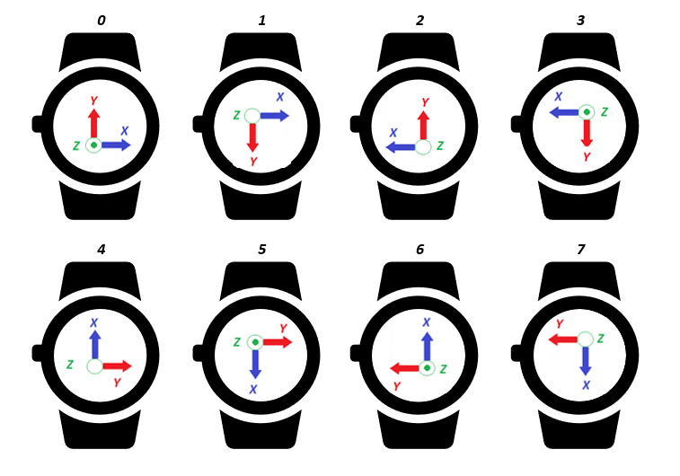

# edmp_wearable

This application demonstrates how to configure and use wearable features.

It enables accel in Low-Power mode at 50Hz.

It loads extended features RAM image, handling B2S (Bring to See), and starts eDMP to detect B2S and reverse B2S events through INT1.
Power save mode can be selected and works in addition with Wake On Motion (WOM) to wake up eDMP only when motion is detected.

## Command interface

This application allows the following command to be sent through UART:
* `o`: to enable/disable Power save mode (defaults to disable).
* `c`: to print current configuration.
* `h`: to print help screen.

## Limitations

The B2S is an embedded feature running in the eDMP. The host must load a custom eDMP image to enable this feature.

The custom image loaded into eDMP will replace all other eDMP features. Therefore, running B2S will prevent usage of the following features:
* Pedometer
* Tilt
* Tap
* SMD
* RaiseToWake
* FreeFall
* LowG
* HighG
* Selftest

## Terminal output

### Data format

Data are printed on the terminal as follow:


#### B2S event
```
<timestamp> us B2S
<timestamp> us B2S REVERSE
```

With:
* `<timestamp>`: Time in microsecond read from MCU clock when latest INT1 was fired.

`B2S` gesture is detected when doing a positive rotation around X axis. `Reversed B2S` gesture is detected when doing a negative rotation around X axis. When the device is going back to its original position (from `B2S` or `Reversed B2S`), another `B2S` event is generated.

Considering a watch form factor, a `B2S` event is fired when the user looks at the screen. A `B2S REVERSE` event is fired when the device goes back to its previous position.

A mounting matrix can be configured with `b2s_params.b2s_mounting_matrix`. Please refer to the following picture to identify how to set the mounting matrix, depending on the IMU reference frame, so the 'B2S' interrupt is fired when user looks at the screen.




### Example of output

```
[I] ###
[I] ### Example EDMP WEARABLE B2S
[I] ###
[I]       1946462 us   B2S
[I]       2977716 us   B2S
[I]      34806104 us   B2S REVERSE
[I]      36035669 us   B2S
[I]      37126366 us   B2S
[I]      37741121 us   B2S REVERSE
[I]      40457867 us   B2S
[I]      41469262 us   B2S REVERSE
[I]      42480618 us   B2S
[I]      43511877 us   B2S

```

